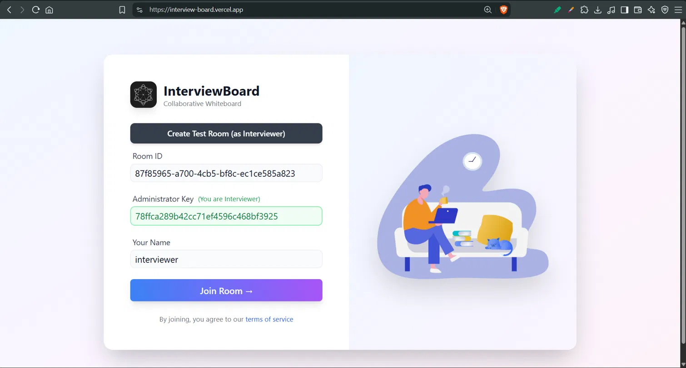
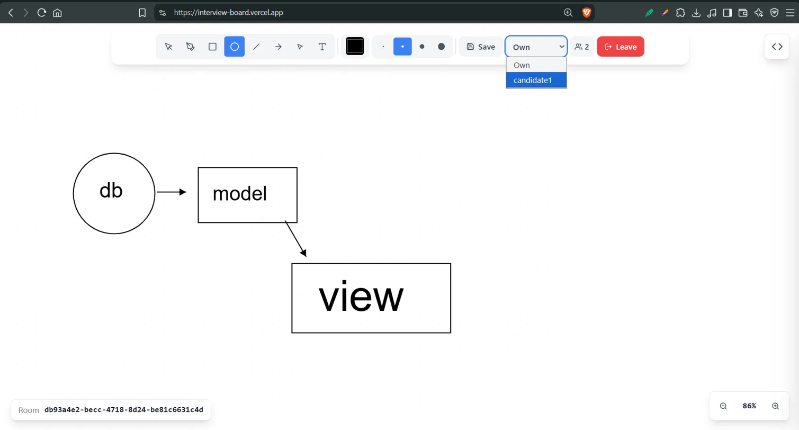
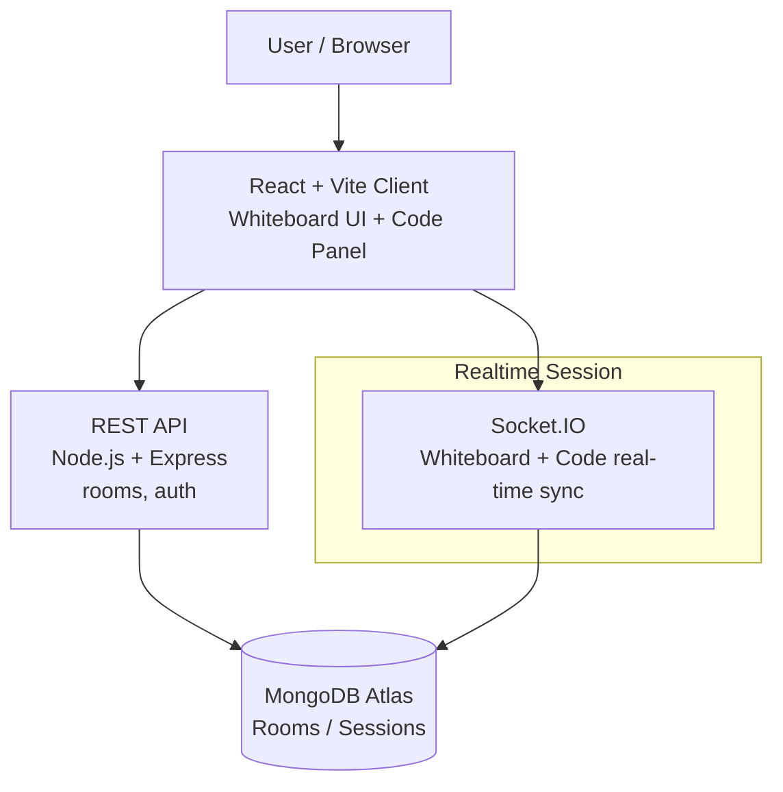

# InterviewBoard

> A real-time collaborative whiteboard and code review tool built for conducting technical mock interviews.

🔗 **Live Demo:** https://interview-board.vercel.app/

---

## 📸 Preview

| Join a Room | Shared Whiteboard |
|---|---|
|  |  |
| Interviewer gets a Room ID + Administrator Key; candidates join with the Room ID and their name. | Real-time shared canvas for sketching diagrams, system designs, and explanations. |

| Code Editor (Interviewer view) | Switch Between Participants |
|---|---|
|  |  |
| Interviewer views a candidate's code live, in read-only mode. | Dropdown lets the interviewer switch between "Own" and any connected candidate. |

---

## 📌 Overview

**InterviewBoard** lets an interviewer spin up a room, share a Room ID with a candidate, and run a live technical interview session that combines:

- a **shared whiteboard** for sketching system designs, diagrams, and explanations, and
- a **per-participant code panel** where the interviewer can view (read-only) the code each candidate is writing, in real time.

Rooms are protected by an **Administrator Key** so only the interviewer has host controls, while candidates join with just the Room ID and their name.

---

## ✨ Features

* 🧩 **Room-Based Sessions** — Create a room as Interviewer, get a unique Room ID + Administrator Key, and share the Room ID with candidates to join.
* 🎨 **Collaborative Whiteboard** — Shapes (rectangle, ellipse, line, arrow, triangle), freehand/lasso select, text tool, adjustable stroke color and width, all synced live across participants.
* 👨‍💻 **Per-Candidate Code View** — A built-in code editor panel lets the interviewer switch between "My Code" and any connected candidate's code (e.g. `candidate1`), viewed **read-only** with line numbers.
* 👥 **Live Participant Tracking** — See how many people are currently in the room.
* 💾 **Save Board State** — Save the current whiteboard.
* 🔗 **Embed / Share** — Quick access to embed or share the board via the code (`</>`) icon.
* 🚪 **Leave Room** — Cleanly exit an active session.
* 📱 **Responsive, Distraction-Free UI** — Minimal toolbar, dotted-grid canvas, zoom controls.

---

## 🛠️ Tech Stack

> Update this section with the exact libraries used — assumed based on the app's real-time, multi-cursor behavior.

**Frontend:** React.js, Vite, Tailwind CSS, Canvas/SVG-based whiteboard rendering
**Real-time sync:** Socket.IO (or an equivalent CRDT library such as Yjs, if used for the whiteboard/code sync)
**Backend:** Node.js, Express.js
**Database:** MongoDB Atlas
**Deployment:** Vercel

---

## 🏗️ Architecture



---

## 📂 Project Structure

```text
InterviewBoard/
│
├── client/                 # React frontend
│   ├── src/
│   │   ├── components/
│   │   │   ├── Whiteboard/
│   │   │   ├── CodeEditor/
│   │   │   └── RoomJoin/
│   │   └── ...
│   ├── public/
│   └── package.json
│
├── server/                 # Node.js + Express backend
│   ├── routes/             # room creation/join, auth
│   ├── models/             # Room, Participant, CodeSession
│   ├── controllers/
│   ├── socket/              # whiteboard + code sync events
│   └── package.json
│
├── README.md
└── .gitignore
```

> The exact structure may vary depending on the current repository organization.

---

## 🚀 Getting Started

### 1. Clone the Repository

```bash
git clone https://github.com/IshikaS2006/InterviewBoard.git
cd InterviewBoard
```

### 2. Install Dependencies

```bash
# Frontend
cd client
npm install

# Backend
cd ../server
npm install
```

### 3. Configure Environment Variables

Create a `.env` file in the `server` directory:

```env
MONGODB_URI=your_mongodb_connection_string
PORT=5000
```

Add any frontend API/socket configuration required in `client/.env`.

### 4. Start the Backend

```bash
cd server
npm run dev
```

### 5. Start the Frontend

```bash
cd client
npm run dev
```

The app will be available at the local Vite dev server (typically `http://localhost:5173`).

---

## 🖥️ How It Works

1. **Create a Room** — The interviewer clicks "Create Test Room (as Interviewer)" and receives a **Room ID** and **Administrator Key**.
2. **Join as Candidate** — Candidates enter the Room ID and their name to join; interviewers can rejoin with the Administrator Key to retain host privileges.
3. **Whiteboard** — All participants can draw and annotate on a shared canvas synced in real time.
4. **Code Review** — The interviewer switches the panel dropdown ("Own" / candidate name) to view that candidate's code live, in read-only mode.
5. **Leave** — Either party can leave the room at any time, freeing the Room ID.

---

## 📸 Screenshots

*Add exported screenshots to a `screenshots/` folder and reference them here, e.g.:*

```text
screenshots/
├── room-join.png        # Room ID / Administrator Key / Join screen
├── whiteboard.png        # Shared drawing canvas
└── code-editor.png       # Per-candidate read-only code panel
```

---

## 🌐 Deployment

The application is deployed on **Vercel**.

**Live Application:** https://interview-board.vercel.app/

---

## 🧠 What I Learned

Building InterviewBoard helped me gain practical experience with:

* Building a full-stack, real-time collaborative React application
* Designing REST APIs with Express.js for room/session management
* Implementing real-time whiteboard and code sync between multiple connected clients
* Managing per-user (interviewer vs. candidate) permissions and read-only views
* Connecting a Node.js backend with MongoDB Atlas
* Structuring and deploying a production web application

---

## 🔮 Future Improvements

* Voice/video call integration alongside the whiteboard
* Interview history and session recordings
* Candidate performance notes and scoring
* Multiple candidates in a single room with tabbed code views
* Enhanced authentication (OAuth login instead of raw Admin Key)

---

## 👩‍💻 Author

**Ishika Singh**

* GitHub: [IshikaS2006](https://github.com/IshikaS2006)
* LinkedIn: [Ishika Singh](https://www.linkedin.com/)

---

## 📄 License

This project is developed for educational and portfolio purposes.
